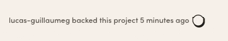

Title: Storing live events in Redis sorted sets
Date: 2021-04-09
Author: Yann Salaün
Avatar: /theme/build/img/yann.png

## Live events

A feature was recently released on the project page on the Ulule website: live
events. The main idea is to display recent events that happened on the project.
The events may be of the following kind: "There has been X contributions in the
last Y hours", "User foo published a news X minutes ago", "There are X users on
the page", etc. And if a new event happens while the page is open, data is
automatically updated "live", without refreshing.

This is what the feature looks like:



To see it in action, pickup a popular project on [https://www.ulule.com/discover/](https://www.ulule.com/discover/)
and just visit the project page.

How data in the webpage is updated live is an interesting topic, but in this
article we focus on how data is stored on the backend, and how it can be updated
and queried efficiently.

In particular the requirements are the following:

* Some events are just counters, whereas other events are lists of objects: for example, we want the "User foo published a news X minutes ago" event to be an object with the link to the actual news.
* Different event types have different expiration durations: we want the count of contributions during the latest 24h, but the name of the latest contributors only during the latest 30min.
* Some events have a special expiration: they expire when the webpage is closed.

## Redis

We decided to go with [Redis](https://redis.io/) as a datastore for this
application, because it has the following properties:

* It has pubsub features that may be useful for live updates.
* Durability is not super important here. If there's a power cut, we may lose data, but data in this application is not critical anyway, the dataset can be rebuilt easily and will actually rebuild itself in ~24h (24h is the longest expiration duration of all the events we need to store). So we may just completely disable durability for maximum performance.
* We already use Redis for a lot of other things, so it's not a problem for us to setup more instances.

Also, the sorted set data structure in Redis is a great fit for this kind of
access pattern.

Let's make a brief introduction to this sorted set data structure:

* It's a set of records where each record is sorted with a score.

Here we create a sorted set with popular Ulule projects, and where the score is
the amount raised.

```
> ZADD projects 681046 noob-le-film
> ZADD projects 1246852 noob-le-jeu-video
> ZADD projects 532662 noob-lencyclopedie
> ZCARD projects
3
> ZRANGE projects 0 -1
1) "noob-lencyclopedie"
2) "noob-le-film"
3) "noob-le-jeu-video"
```

The ZADD command adds records to the sorted set, the ZCARD command returns the
count of items in the sorted set, and the ZRANGE command returns a range of
items. Items are zero-indexed, so 0 is the first item in the range, and negative
indexes count from the end of the range, so -1 is the last item in the range.

The ZRANGE command supports a large range of options to query the sorted set in
a different order or with different pagination parameters.

* It's super simple (and efficient) to query and to delete by score range.

Here we query only the items that have a score > 1000000, and then we remove the
items that have a score < 1000000.

```
> ZRANGEBYSCORE projects 1000000 +INF WITHSCORES
1) "noob-le-jeu-video"
2) "1246852"
> ZREMRANGEBYSCORE projects -INF 1000000
> ZCARD projects
(integer) 1
```

* Items in the sorted set are unique

```
> ZADD users 1 yann
(integer) 1
> ZADD users 2 yann
(integer) 0
> ZADD users 3 yann
(integer) 0
> ZCARD users
(integer) 1
```

Now that we know how sorted sets work, let's go back to our live events.

## Time series

The trick is to use a Unix timestamp as the score, which makes the sorted set a
time serie.

Let's try it with the `news.published` event:

```
# Add a news.published event for the project with ID 123
> ZADD news.published:123 <now> "{\"url\":\"https://...\"}"
# Remove expired events (older that 24h)
> ZREMRANGEBYSCORE news.published:123 -INF <now-24h>
# List the remaining events
> ZRANGE news.published:123 0 -1
1) "{\"url\":\"https://...\"}"
2) ...
```

Creating a new item is just ZADD, and listing all the events is two commands:
ZREMRANGEBYSCORE and ZRANGE.

Let's try with a counter.

```
# Add a supporters_count.incred event
> ZADD supporters_count.incred:123 <now> <contribution_id>
# Remove expired events
> ZREMRANGEBYSCORE supporters_count.incred:123 -INF <now-24h>
# Count the events
> ZCARD supporters_count.incred:123
(integer) 42
```

The only two differences with the first case are that items are just the
contribution ID (to avoid duplicate items), and we just need the number of
items, not full objects.

There's one thing missing: how do we expire events when the webpage is closed?

* We make the expiration duration show (we use 1min in our application)

* While the webpage is open, we update the score every ~half the expiration
duration.

```
> ZADD visitors_count.incred:123 <now> <host:port>
> ZREMRANGEBYSCORE visitors_count.incred:123 -INF <now-1min>
```

* When the webpage is closed, we remove the record.

```
> ZREM visitors_count.incred:123 <host:port>
> ZREMRANGEBYSCORE visitors_count.incred:123 -INF <now-1min>
> ZCARD visitors_count.incred:123
```

## What else?

Unpublishing an event (for example a news has been unpublished, or a
contribution has been cancelled) can trivially be implemented via the ZREM
command.

Doing a bulk import of all the recent events may also be a useful feature for
migrations (for example if we decide to change the expiration of the
news.published event from 24h to 48h), and can also be trivially implemented via
the ZADD command.

## What doesn't work?

With this design, the backend never sends a live update to the client when an
event expires. For example, let's say a news has been published 23h59min ago,
and we open the webpage. We see the event on the page but if no more events are
ever happening on this webpage, the server will never tell the client that the
event has expired.

If it's required for the client to expire this event, then it must be aware of
expiration durations.

## Numbers

On the Ulule website, the load to this application is quite reasonable. The
orders of magnitude are the following: 2k+ Redis sorted sets with a memory
footprint of ~6MB, and a load of ~200 requests per second. So really, a super
small instance of Redis is enough for our use case.

## Conclusion

This design has served us well. It's simple, efficient, and fun to develop an
application that uses Redis sorted sets as time series. We plan to reuse it for
internal features where users could see other users connected to the same
webpage.
